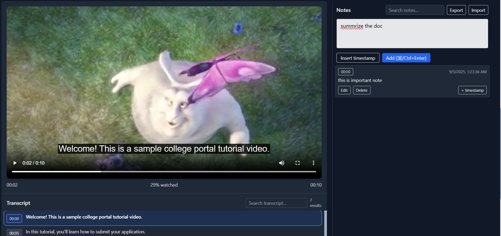
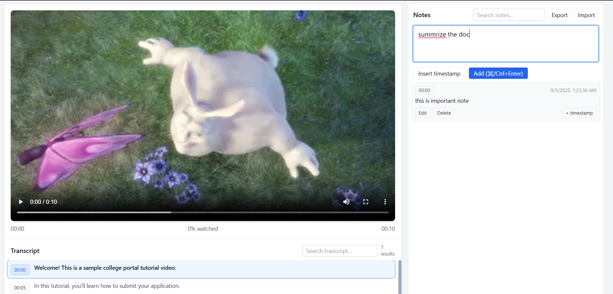
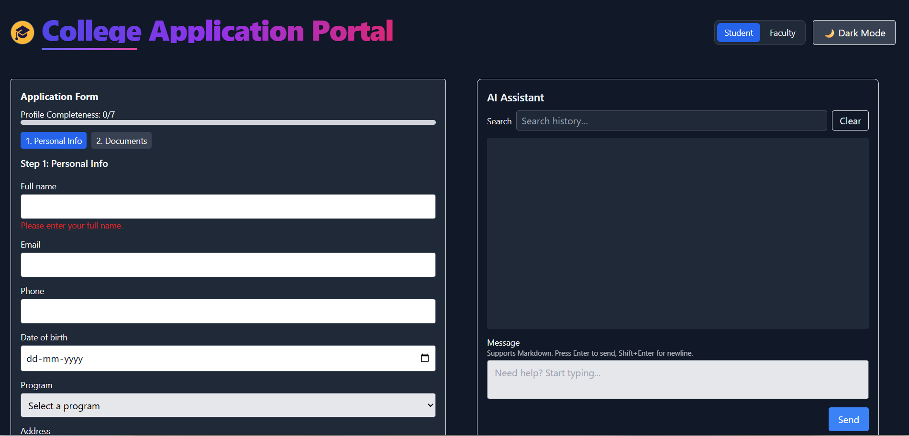
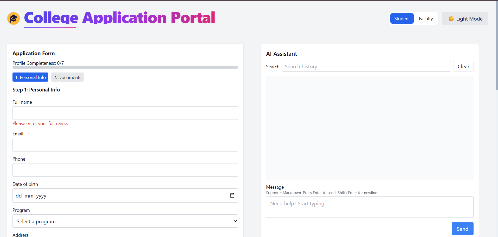
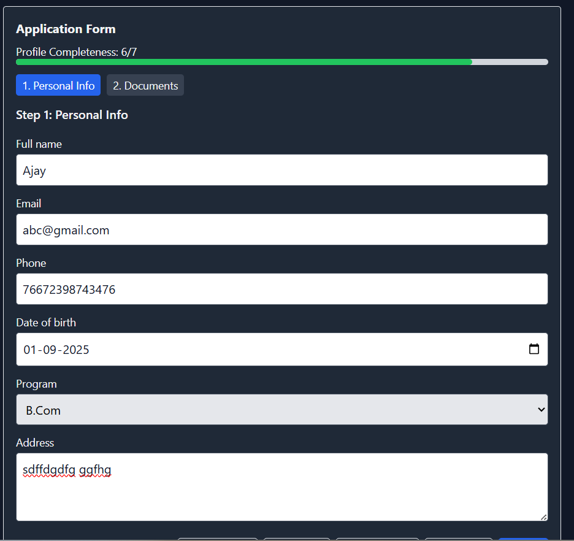
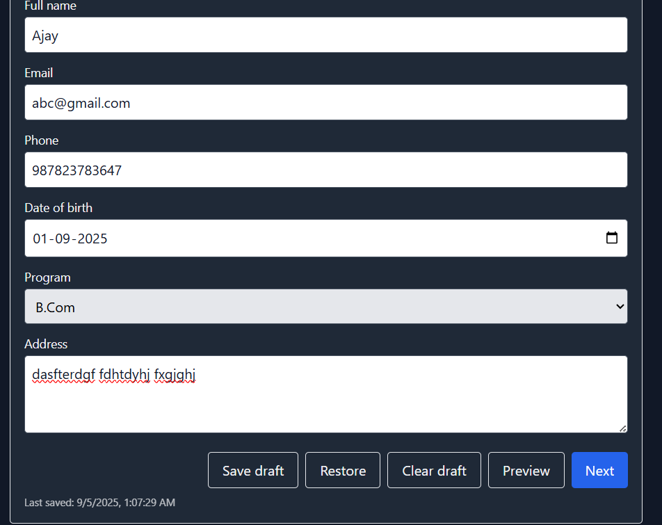
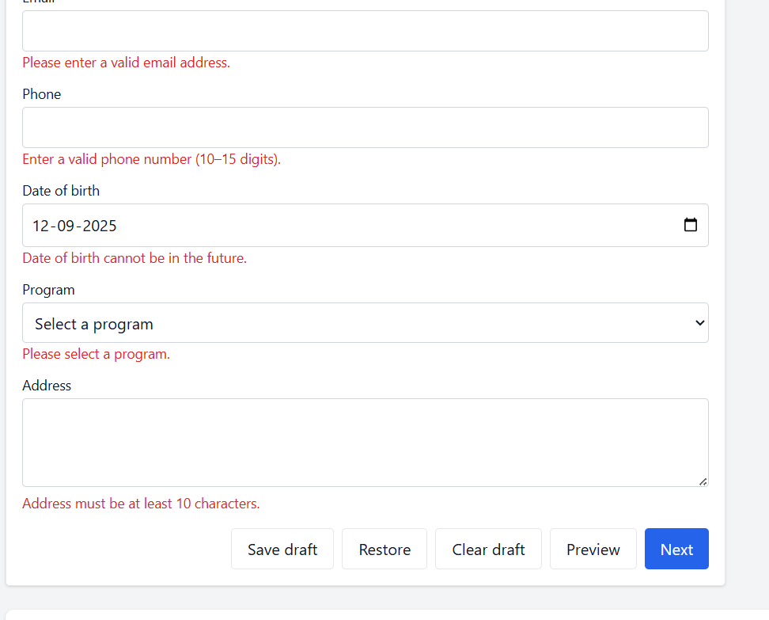
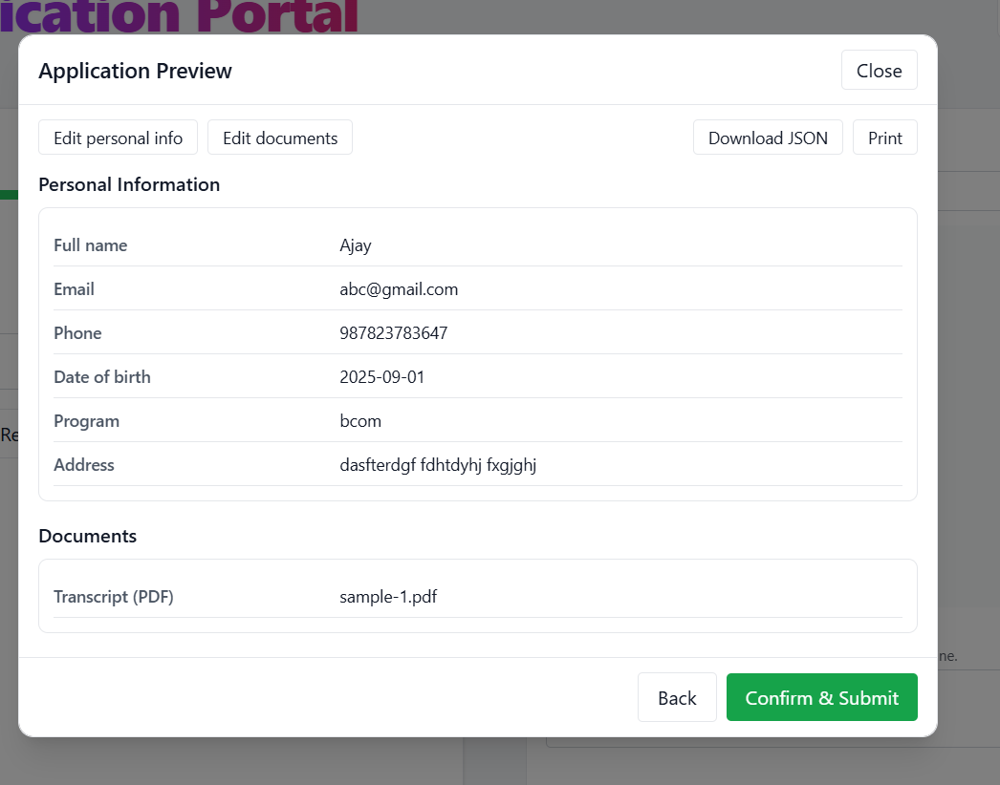

# College Portal

A modern college portal built with React, TypeScript, Vite, and Tailwind CSS.

---

## 📁 Folder Structure

```
college-portal/
├── .gitignore
├── eslint.config.js
├── index.html
├── LICENSE
├── package.json
├── postcss.config.js
├── README.md
├── tailwind.config.js
├── tsconfig.app.json
├── tsconfig.json
├── tsconfig.node.json
├── vite.config.ts
├── public/
│   ├── vite.svg
│   └── transcripts/
│       └── college-tutorial.vtt
└── src/
    ├── App.css
    ├── App.tsx
    ├── index.css
    ├── main.tsx
    ├── setupTests.ts
    ├── vite-env.d.ts
    ├── a11y/
    │   ├── Announcer.tsx
    │   ├── usePrefersReducedMotion.ts
    │   └── VisuallyHidden.tsx
    ├── assets/
    │   ├── application.jpg
    │   └── react.svg
    ├── components/
    │   ├── ApplicationForm/
    │   │   ├── ApplicationPreview.tsx
    │   │   ├── DocumentUpload.tsx
    │   │   ├── MultiStepForm.tsx
    │   │   ├── ProfileCompleteness.tsx
    │   │   └── tests/
    │   │       └── MultiStepForm.validation.test.tsx
    │   ├── ChatBot/
    │   │   ├── ChatWindow.tsx
    │   │   ├── MessageBubble.tsx
    │   │   └── tests/
    │   │       └── ChatWindow.test.tsx
    │   ├── faculty-review/
    │   │   ├── ApplicationDetail.tsx
    │   │   ├── ApplicationList.tsx
    │   │   ├── DecisionBadge.tsx
    │   │   ├── FacultyReviewDashboard.tsx
    │   │   ├── mock.ts
    │   │   ├── ReviewToolbar.tsx
    │   │   ├── types.ts
    │   │   ├── useApplications.ts
    │   │   └── tests/
    │   │       ├── ApplicationDetail.test.tsx
    │   │       ├── ApplicationList.test.tsx
    │   │       ├── DecisionBadge.test.tsx
    │   │       ├── ReviewToolbar.test.tsx
    │   │       └── useApplications.reducer.test.ts
    │   ├── UI/
    │   │   ├── DarkModeToggle.tsx
    │   │   ├── ProgressBar.tsx
    │   │   ├── SkipLink.tsx
    │   │   └── tests/
    │   │       └── DarkModeToggle.test.tsx
    │   └── VideoTutorial/
    │       ├── Notes.tsx
    │       ├── Transcript.tsx
    │       ├── types.ts
    │       ├── VideoPlayer.tsx
    │       ├── vtt.ts
    │       └── tests/
    │           └── VideoTutorial.basic.test.tsx
    ├── hooks/
    │   ├── useChatHistory.ts
    │   ├── useDarkMode.ts
    │   └── useLocalStorage.ts
    ├── pages/
    │   ├── FacultyPortal.tsx
    │   └── StudentPortal.tsx
    ├── tests/
    │   ├── App.tabs.test.tsx
    │   └── StudentToFaculty.integration.test.tsx
    └── types/
        └── chat.ts
```

---

## 🚀 Setup Instructions

1. **Clone the repository**
   ```sh
   git clone https://github.com/mansi-swami/college-portal.git
   cd college-portal
   ```

2. **Install dependencies**
   ```sh
   npm install
   ```

3. **Run the development server**
   ```sh
   npm run dev
   ```

4. **Run tests**
  **Add in package.json**
   "scripts": {
  "test": "vitest"
}
   ```sh
   npm install --save-dev vitest jsdom @testing-library/react @testing-library/jest-dom
   npm test
   ```

---

## 📦 Component Documentation

- **ApplicationForm**
  - `MultiStepForm.tsx`: Multi-step application form for students.
  - `DocumentUpload.tsx`: Upload documents for applications.
  - `ProfileCompleteness.tsx`: Shows profile completion status.
  - `ApplicationPreview.tsx`: Preview application before submission.

- **ChatBot**
  - `ChatWindow.tsx`: Student-faculty chat interface.
  - `MessageBubble.tsx`: Individual chat messages.

- **Faculty Review**
  - `FacultyReviewDashboard.tsx`: Faculty dashboard for reviewing applications.
  - `ApplicationList.tsx`: List of student applications.
  - `ApplicationDetail.tsx`: Detailed view of an application.
  - `DecisionBadge.tsx`: Shows application decision status.
  - `ReviewToolbar.tsx`: Actions for faculty review.

- **UI**
  - `DarkModeToggle.tsx`: Toggle dark/light mode.
  - `ProgressBar.tsx`: Progress indicator.
  - `SkipLink.tsx`: Accessibility skip link.

- **VideoTutorial**
  - `VideoPlayer.tsx`: Embedded video tutorial.
  - `Transcript.tsx`: Synchronized transcript display.
  - `Notes.tsx`: Take notes while watching.

---

## 🖼️ Screenshots

> _Add screenshots of key interfaces here (e.g., Application Form, Faculty Dashboard, ChatBot, Video Tutorial)._

- 
- 
- 
- 
- 
- 
- 
- 
- 
- 
- 
- 


---

## ✅ Completed Features

- Student application multi-step form
- Document upload component for transcripts/certificates (PDF only)
- Profile completeness indicator
- Chat interface with Al assistant for application help
- Application preview mode
- Faculty dashboard for reviewing applications
- Support markdown rendering in responses
- Message history management
- Accessibility features (skip links, announcer, visually hidden)
- Dark/light mode toggle
- Video tutorial with transcript and notes
- Implement a video player component (add sample video)
- Progress tracking for watched sections
- Transcript display below video
- Export and import notes add,edit and delete notes with timestamp
- Saved Draft functionality
- Search through chat history
- Unit and integration tests for key components


---

## 📄 License

This project is licensed under the MIT License.